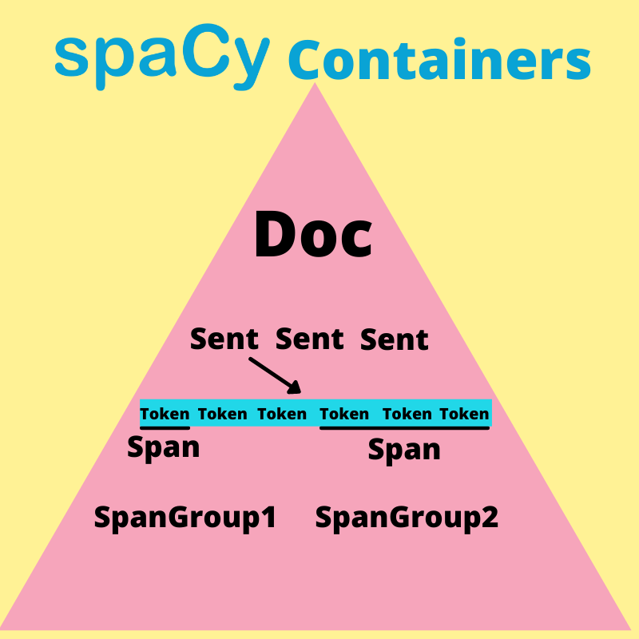

# spaCy (The Rule based aspects)

Here, I am writing code and just basic documentation for my own understanding by following freecodecamp tutorial of spaCy and core NLP concepts. This is not ML based repo (for a change).  

I am working on ML based NLP repo which will be on my profile soon. 

## NLP vs NLU

NLP is basically a superset and NLU can be considered as subset.
 

### Natural Language Processing:
1. Named Entity Recognition
2. Part-of-Speech Tagging
3. Syntactic Parsing
4. Text Categorization
5. Coreference Resolution
6. Machine Translation
  

### Natural Language Understanding
1. Relation Extraction
2. Paraphrasing
3. Semantic Parsing
4. Sentiment Analysis
5. Question and Answersing
6. Summarization

Most of these areas are very important and used extensively by industry and spaCy provides lots of functionality for most of tasks listed here (If I say in django language, batteries included!).

 

Recently, I was going through Graph Neural Networks (great start to topic [here](https://distill.pub/2021/gnn-intro/)) and found out graphs are way to represent images instead of using conventional grid representation and I also found out text (unstructured data) can also be represented using graphs which is why I am learning this stuff now. 

## Installation of spaCy

It is pretty straight forword process where [spaCy download website](https://spacy.io/usage) gives direct selections of hardware, OS etc. and gived direct commands to install in git bash or whatever terminal you use with supports to `pip` and `conda` package managers. 

## Basics of NLP with spaCy

### Containers

Containers are spaCy objects that contain large amount of data about text. For text analysis purpose, we create multiple container objects to analyze data.  

List of spaCy containers:
1. Doc
2. DocBin
3. Example
4. Language
5. Lexeme
6. Span
7. SpanGroup
8. Token

[Tutorial I am following](https://www.youtube.com/watch?v=dIUTsFT2MeQ) discussing mainly about Doc, Span and Token.

Here is visualization of spaCy container by Dr. W.J.B. Mattingly.  

