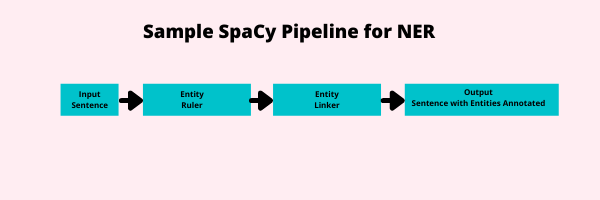

# spaCy (The Rule based aspects)

Here, I am writing code and just basic documentation for my own understanding by following freecodecamp tutorial of spaCy and core NLP concepts. This is not ML based repo (for a change).  

I am working on ML based NLP repo which will be on my profile soon. 

## NLP vs NLU

NLP is basically a superset and NLU can be considered as subset.
 

### Natural Language Processing:
1. Named Entity Recognition
2. Part-of-Speech Tagging
3. Syntactic Parsing
4. Text Categorization
5. Coreference Resolution
6. Machine Translation
  

### Natural Language Understanding
1. Relation Extraction
2. Paraphrasing
3. Semantic Parsing
4. Sentiment Analysis
5. Question and Answersing
6. Summarization

Most of these areas are very important and used extensively by industry and spaCy provides lots of functionality for most of tasks listed here (If I say in django language, batteries included!).

 

Recently, I was going through Graph Neural Networks (great start to topic [here](https://distill.pub/2021/gnn-intro/)) and found out graphs are way to represent images instead of using conventional grid representation and I also found out text (unstructured data) can also be represented using graphs which is why I am learning this stuff now. 

## Installation of spaCy

It is pretty straight forword process where [spaCy download website](https://spacy.io/usage) gives direct selections of hardware, OS etc. and gived direct commands to install in git bash or whatever terminal you use with supports to `pip` and `conda` package managers. 

## Basics of NLP with spaCy

### Containers

Containers are spaCy objects that contain large amount of data about text. For text analysis purpose, we create multiple container objects to analyze data.  

List of spaCy containers:
1. Doc
2. DocBin
3. Example
4. Language
5. Lexeme
6. Span
7. SpanGroup
8. Token

[Tutorial I am following](https://www.youtube.com/watch?v=dIUTsFT2MeQ) discussing mainly about Doc, Span and Token.

Here is visualization of spaCy container by Dr. W.J.B. Mattingly.  

spaCy Doc container does much more with its tokenization than a simple split method. Mistakes in spaCy tokenizers are very rare. That is why rather than writing complex langugae tokenizer functions from scratch, it is better to use spaCy's function. 

### Sentence Boundary Detection (SBD)

SBD is detection of sentence in text data. A simple python function to find sentence would be splitting data by "." but we use same symbol for abbreviations. Due to this reason, there are possibilities of algorithm detecting wrong statements from text if applied with simple split logic. 

### Token Attributes

List of token attributes:
1. .text
2. .head
3. .left_edge
4. .right_edge
5. .ent_type_
6. .iob_
7. .lemma_
8. .morph
9. .pos_
10. .dep_
11. .lang_

### Part of Speech Tagging (POS)

In the field of computational linguistics, understanding parts-of-speech is essential. SpaCy offers an easy way to parse a text and identify its parts of speech.

### Named Entity Recognition (NER)

Named-entity recognition is a subtask of information extraction that seeks to locate and classify named entities mentioned in unstructured text into pre-defined categories such as person names, organizations, locations, medical codes, time expressions, quantities, monetary values, percentages, etc.

## Word Vectors and spaCy

### Word Vectors

The goal of word vectors is to achieve numerical understanding of language so that a computer can perform more complex tasks on that corpus. While looking for synonyms, normal approach we usually thinks is to create dictionary and look for words. This idea sounds pretty good while dealing with basic words but there will be just too many conditions. Like if I give input as 'Ram', system may not understand name and give error. Also, if I use some slang words or similar phrases, system may get confused. Imagine using word "garbage down" and system will not give synonym as "eat". One more issue would be, it would be computationally very expensive to iterate through whole dictionary each time you need to find words.  
For this specific reason and more, we needs to create word vectors. Also, numerical values are easier to feed to computational machines. 

#### What do word vectors looks like?

Word vectors have a preset number of dimensions. These dimensions are honed via machine learned. Models take into account word frequency alongside words across a corpus and the appearance of other words in similar contexts. This allows for the the computer to determine the syntactical similarity of words numerically. It then needs to represent these relationships numerically. It does this through the vector, or a matrix of matrices. To represent these more concisely, models flatten a matrix to a float (decimal number). The number of dimensions represent the number of floats in the matrix.

#### Why use Word Vectors?

Once a word vector model is trained, we can do similarity matches very quickly and very reliably.

### Doc Similarity

In spaCy we can do this same thing at the document level. Through word vectors we can calculate the similarity between two documents.

### Word Similarity

We can also calculate the similarity between two given words.

## spaCy's Pipelines

spaCy gives various pipelines, heuristic (rule-based) and Machine Learning based approaches. These solutions are activated by pipes.

### Standard Pipes (Components and Factories) available for spaCy

SpaCy is much more than an NLP framework. It is also a way of designing and implementing complex pipelines. A pipeline is a sequence of pipes, or actors on data, that make alterations to the data or extract information from it. In some cases, later pipes require the output from earlier pipes. In other cases, a pipe can exist entirely on its own.

 
Here, we see an input, in this case a sentence, enter the pipeline from the left. Two pipes are activated on this, a rules-based named entity recognizer known as an EntityRuler which finds entities and an EntityLinker pipe that identifies what entity that is to perform toponym resolution. The sentence is then outputted with the sentence and the entities annotated. At this point, we could use the doc.ents feature to find the entities in our sentence. 

ML pipes use Tok2Vec usually as input layer to vectorize input sentence. 

#### Attribute Rulers

1. Dependency Parser
2. EntityLinker
3. EntityRecognizer
4. EntityRuler
5. Lemmatizer
6. Morpholog
7. SentenceRecognizer
8. Sentencizer
9. SpanCategorizer
10. Tagger
11. TextCategorizer
12. Tok2Vec
13. Tokenizer
14. TrainablePipe
15. Transformer

#### Matchers

1. DependencyMatcher
2. Matcher
3. PhraseMatcher

### How to add pipes

Work in progress...